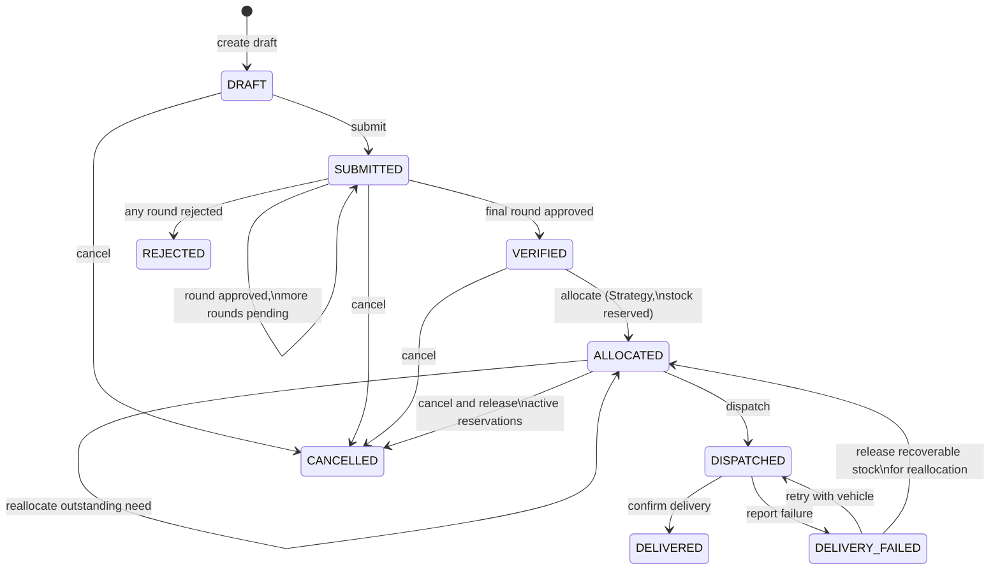

# Architecture

## Layering

```text
JavaFX panes (com.reliefsync.ui)
        ↓
ReliefOperationFacade (workflows) + services (com.reliefsync.service)
        ↓
State / Chain of Responsibility / Strategy (pattern packages)
        ↓
Repositories (com.reliefsync.repository)
        ↓
Database singleton → SQLite (data/reliefsync.db)
```

Dependency rules:

- UI never contains SQL and never talks to repositories for workflow actions — only to the facade and services.
- Services contain business rules and transactions; they delegate lifecycle legality to State, verification depth to the Chain, and distribution policy to Strategy.
- Repositories contain all SQL (parameterized, bounded) and row mapping; they hold no business rules.
- Pattern packages are pure Java with no JavaFX or JDBC imports, so all business logic is unit-testable without a UI or database.

## ER diagram

```mermaid
erDiagram
    USERS ||--o{ RELIEF_REQUESTS : creates
    USERS ||--o{ VERIFICATIONS : decides
    AFFECTED_AREAS ||--o{ RELIEF_REQUESTS : "requests relief"
    RELIEF_REQUESTS ||--|{ REQUEST_ITEMS : contains
    RELIEF_REQUESTS ||--o{ VERIFICATIONS : "verified by rounds"
    RELIEF_REQUESTS ||--o{ ALLOCATIONS : "fulfilled by"
    RELIEF_REQUESTS ||--o{ ALLOCATION_EVENTS : "allocation audited by"
    RELIEF_REQUESTS ||--o{ STATUS_HISTORY : "audited by"
    RELIEF_REQUESTS ||--o{ DISPATCH_MANIFESTS : "dispatched with attempts"
    RELIEF_REQUESTS ||--o{ DELIVERY_FAILURES : "records"
    RESOURCES ||--o{ REQUEST_ITEMS : "requested as"
    RESOURCES ||--o{ INVENTORY : "stocked as"
    RESOURCES ||--o{ ALLOCATIONS : "allocated as"
    ALLOCATIONS ||--o{ ALLOCATION_EVENTS : "records events"
    ALLOCATIONS ||--o{ DISPATCH_MANIFEST_ITEMS : "loaded across attempts"
    RELIEF_CENTERS ||--o{ INVENTORY : holds
    RELIEF_CENTERS ||--o{ ALLOCATIONS : supplies
    VEHICLES ||--o{ DISPATCH_MANIFESTS : carries
    DISPATCH_MANIFESTS ||--|{ DISPATCH_MANIFEST_ITEMS : contains
    DISPATCH_MANIFESTS ||--o| DELIVERY_FAILURES : "may fail as"
    USERS ||--o{ DELIVERY_FAILURES : reports

    USERS { int id PK "username UNIQUE, role, password_hash (PBKDF2)" }
    AFFECTED_AREAS { int id PK "name UNIQUE, district, population, severity 1-5, active" }
    RELIEF_CENTERS { int id PK "name UNIQUE, location, capacity, active" }
    RESOURCES { int id PK "name UNIQUE, unit, low_stock_threshold, active" }
    INVENTORY { int id PK "center_id FK + resource_id FK UNIQUE, quantity >= 0" }
    RELIEF_REQUESTS { int id PK "area_id FK, priority, status, created_by FK" }
    REQUEST_ITEMS { int id PK "request_id FK, resource_id FK, qty_requested > 0, qty_allocated" }
    VERIFICATIONS { int id PK "request_id FK, round_role, verifier_id FK, approved, comment" }
    ALLOCATIONS { int id PK "request_id FK, center_id FK, resource_id FK, quantity > 0, strategy, active, release metadata" }
    ALLOCATION_EVENTS { int id PK "request_id FK, allocation_id FK, event type, quantity, actor, timestamp" }
    VEHICLES { int id PK "registration UNIQUE, type, capacity > 0, availability status" }
    DISPATCH_MANIFESTS { int id PK "request_id FK + attempt_number UNIQUE, vehicle_id FK, driver, status, timestamps" }
    DISPATCH_MANIFEST_ITEMS { int id PK "manifest_id + allocation_id UNIQUE, quantity > 0" }
    DELIVERY_FAILURES { int id PK "request_id FK, manifest_id UNIQUE FK, reason, reporter FK, recovery action, timestamps" }
    STATUS_HISTORY { int id PK "request_id FK, from_status, to_status, changed_by, changed_at" }
```



Constraints are enforced in the schema: foreign keys (with `PRAGMA foreign_keys=ON`), UNIQUE names, CHECK ranges on severity/quantities, and `UNIQUE(center_id, resource_id)` for inventory upserts. Migrations are versioned in `schema_version` and applied automatically at startup.

## Authentication and signup

Passwords are stored only as salted PBKDF2-HMAC-SHA256 hashes. Login and signup normalize usernames to lowercase, and the database enforces uniqueness. Public signup validates the full name, username, password strength, and password confirmation, then creates a `VOLUNTEER` account only; privileged roles cannot be self-assigned. The new account is persisted before the application starts its authenticated session.

## Request lifecycle



Verification rounds by priority: NORMAL → Area Coordinator; HIGH → + Relief Coordinator; CRITICAL → + Administrator. The administrator may act for any round.

## Transport, failure recovery, and capacity

Dispatch is one atomic operation: validate the ALLOCATED state, load active reservations, validate driver and capacity, conditionally claim an AVAILABLE vehicle, create a numbered manifest attempt and its allocation-backed pickup lines, and transition the request to DISPATCHED. Delivery atomically completes the latest manifest, transitions the request to DELIVERED, and returns the vehicle to AVAILABLE.

Failure reporting is also atomic: the latest manifest becomes `DELIVERY_FAILED`, a reason/reporter/time/recovery record is inserted, the request enters `DELIVERY_FAILED`, and the vehicle returns to `AVAILABLE`. Reserved inventory is deliberately unchanged at this point. A RETRY recovery claims an available capacity-safe vehicle, creates the next immutable manifest attempt from the active reservations, resolves the failure, and returns the request to `DISPATCHED`.

REALLOCATE represents the explicit domain assertion that the failed cargo was physically recovered. An allocation-authorized coordinator performs one transaction that returns each active reservation to its source inventory, marks it released, adjusts request-item totals, records `RELEASED` allocation events, resolves the failure, and moves the request to `ALLOCATED`. The existing reallocation strategy can then reserve stock again. State and conditional repository updates prevent a second recovery from returning the same stock twice.

Vehicle availability follows `AVAILABLE → IN_TRANSIT → AVAILABLE` for delivery, failure, and retry; `MAINTENANCE` and `INACTIVE` vehicles cannot be dispatched. Capacity uses generic academic load units: the sum of active allocated quantities must not exceed vehicle capacity. Manifest lines retain their allocation links, and failed attempts are never overwritten, so vehicle changes and multi-center pickup details remain auditable without route optimization.
