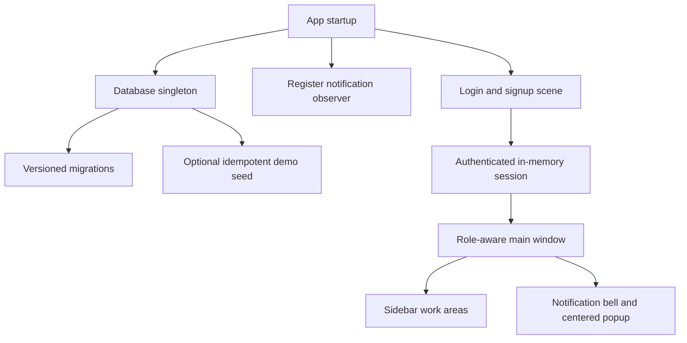
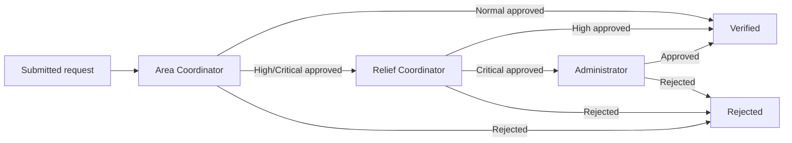
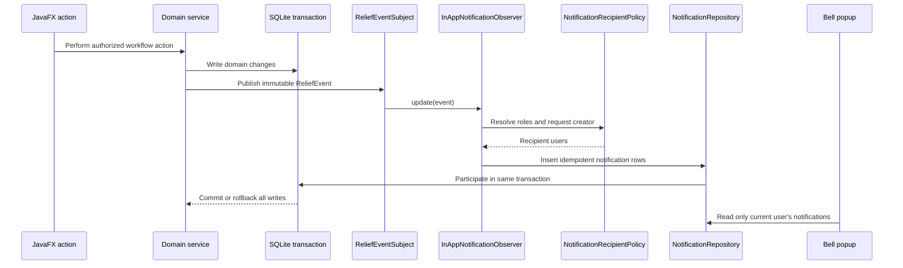

# ReliefSync Architecture

## Architectural goals

ReliefSync is a local JavaFX and SQLite desktop application. Its architecture keeps the project small enough for an academic demonstration while separating interface code, workflow rules, persistence, and design-pattern responsibilities.

The main goals are:

- Keep SQL out of JavaFX panes and workflow algorithms.
- Keep lifecycle, verification, and allocation policies independently testable.
- Make multi-step inventory and dispatch operations atomic.
- Enforce role permissions at the visible feature boundary and sensitive service operations.
- Preserve audit history instead of overwriting operational attempts.
- Add persistent notifications without coupling domain services to popup UI code.

## Runtime overview



Startup order:

1. Open `data/reliefsync.db` and enable SQLite foreign keys.
2. Apply pending migrations in version order.
3. Register exactly one persistent notification observer.
4. Optionally seed demonstration data when `RELIEFSYNC_SEED_DEMO=true`.
5. Show the authentication scene.
6. After login or signup, create the role-aware main scene.

On shutdown, the notification subject is reset and the SQLite connection is closed.

## Layering and dependency direction

```text
JavaFX UI (com.reliefsync.ui)
        ↓
ReliefOperationFacade + application services (facade, service)
        ↓
State / Verification Chain / Allocation Strategy
        ↓                     ↓ domain events
Repositories             ReliefEventSubject
        ↓                     ↓
Database singleton       InAppNotificationObserver
        ↓                     ↓
SQLite  ←──────────── NotificationRepository
```

### Dependency rules

- JavaFX panes do not contain JDBC or SQL.
- Cross-feature request, allocation, dispatch, recovery, and notification operations enter through `ReliefOperationFacade`.
- Focused screens may use focused services for master data, inventory, authentication, and reporting.
- Services validate input, authorize sensitive actions, select legal state transitions, and own transaction boundaries.
- Repositories contain parameterized SQL, bounded searches, row mapping, and conditional persistence operations; they do not render UI.
- `state`, `strategy`, and `verification` are pure Java policy packages without JavaFX or JDBC dependencies.
- Notification event contracts and the subject are independent of JavaFX. The concrete observer intentionally depends on repositories because its responsibility is durable in-app delivery.
- UI notification presentation reads through the facade and never subscribes directly to business events.

## Package responsibilities

| Package | Responsibility |
|---|---|
| `com.reliefsync` | JavaFX application lifecycle |
| `com.reliefsync.ui` | Login/signup, role-aware navigation, work panes, centered notification popup, styling hooks, and dialogs |
| `com.reliefsync.facade` | Stable workflow-oriented API for request-to-delivery operations and related read models |
| `com.reliefsync.service` | Authentication, authorization, validation, transactions, and use-case coordination |
| `com.reliefsync.model` | Domain entities, enums, immutable records, and UI/report read models |
| `com.reliefsync.state` | Request transition policy |
| `com.reliefsync.verification` | Priority-dependent verification chain |
| `com.reliefsync.strategy` | Pure allocation-planning policies |
| `com.reliefsync.notification` | Domain-event subject/observer, recipient policy, and persistent notification handling |
| `com.reliefsync.repository` | SQLite statements and result mapping |
| `com.reliefsync.db` | Connection ownership, transactions, migrations, and optional seeding |
| `com.reliefsync.security` | PBKDF2 password hashing and verification |

## Authentication and role authorization

Passwords are stored as salted PBKDF2-HMAC-SHA256 hashes. Usernames are normalized to lowercase and constrained to 3–30 lowercase letters, digits, or underscores. Passwords must contain uppercase, lowercase, and numeric characters and be 8–128 characters long.

Public signup always creates a `VOLUNTEER`; privileged roles are available only through controlled data setup. The authenticated `User` is stored in `Session` until logout.

`AccessControl` maps roles to feature grants. `MainPane` uses the grants to build only permitted sidebar entries. Request, inventory, allocation, vehicle, and dispatch services independently call `AccessControl.require(...)` for protected mutations. Additional domain rules still apply after the feature check, such as creator-only cancellation and required verification-round roles.

| Feature | Admin | Area Coordinator | Center Manager | Transport Coordinator | Volunteer | Relief Coordinator |
|---|:---:|:---:|:---:|:---:|:---:|:---:|
| Dashboard | ✓ | ✓ | ✓ | ✓ | ✓ | ✓ |
| Affected areas / centers / resources | ✓ |  | ✓ |  |  |  |
| Inventory | ✓ |  | ✓ |  |  |  |
| Create and submit requests | ✓ | ✓ |  |  | ✓ |  |
| Verification entry | ✓ | ✓ |  |  |  | ✓ |
| Allocation and reallocation | ✓ |  |  |  |  | ✓ |
| Dispatch and delivery handling | ✓ |  |  | ✓ |  |  |
| Vehicle management | ✓ |  |  | ✓ |  |  |
| Reports | ✓ | ✓ | ✓ | ✓ |  | ✓ |
| Own notification popup | ✓ | ✓ | ✓ | ✓ | ✓ | ✓ |

Verification entry does not mean every verifier can decide every round. The chain requires Area Coordinator first, Relief Coordinator second for High/Critical, and Administrator third for Critical. Administrator is the explicit override for any pending round.

Cancellation is not a general role grant: the request creator or Administrator may cancel only when the State object permits it.

## JavaFX composition

`SceneManager` switches between two top-level scenes:

- `LoginPane`: authentication shell containing login and signup views.
- `MainPane`: top bar, role-aware sidebar, and replaceable center content.

The main sidebar can show Dashboard, Master Data, Inventory, Relief Requests, Allocation & Dispatch, and Reports. `ContentPane.refresh()` gives each selected work area a consistent data-reload hook.

Notifications are global rather than a sidebar destination. The top-right control order is role label, outlined SVG bell, and Log out. `MainPane` owns one `NotificationsPane` inside a JavaFX `Popup`; each opening reloads the current user's rows and positions the 820 × 480 panel at the horizontal and vertical center of the application window. The red badge is hidden when unread count is zero and displays `99+` above 99. The popup auto-hides on outside click and closes on Escape. Mark-one and mark-all operations call the facade and refresh the badge.

`app.css` supplies the shared visual system for authentication, top bar, navigation, cards, toolbars, forms, tables, status badges, the vector bell, unread badge, and notification popup.

## Request lifecycle

```mermaid
stateDiagram-v2
    [*] --> DRAFT : create
    DRAFT --> SUBMITTED : submit
    SUBMITTED --> SUBMITTED : approve round; more required
    SUBMITTED --> VERIFIED : approve final round
    SUBMITTED --> REJECTED : reject any round
    VERIFIED --> ALLOCATED : reserve planned stock
    ALLOCATED --> ALLOCATED : reserve outstanding stock
    ALLOCATED --> DISPATCHED : vehicle dispatch
    DISPATCHED --> DELIVERED : confirm delivery
    DISPATCHED --> DELIVERY_FAILED : report failure
    DELIVERY_FAILED --> DISPATCHED : retry
    DELIVERY_FAILED --> ALLOCATED : recover and release stock
    DRAFT --> CANCELLED : creator/admin cancel
    SUBMITTED --> CANCELLED : creator/admin cancel
    VERIFIED --> CANCELLED : creator/admin cancel
    ALLOCATED --> CANCELLED : creator/admin cancel and release
```



`RequestStates.of(status)` returns the State object for the persisted enum. Legal methods return the next status; all other transition methods fail centrally with a clear error. Terminal states reject further workflow transitions.

## Verification workflow



The Chain of Responsibility examines immutable verification history, skips already approved rounds, and selects the first pending handler. It enforces the handler role, with Administrator as an override. The request stays `SUBMITTED` between successful intermediate rounds.

## Allocation and inventory consistency

Allocation preview is read-only. A Strategy receives request items and current available inventory and returns planned allocation lines. Preview does not change inventory, request totals, audit rows, or notifications.

Initial allocation and reallocation use one database transaction:

1. Reload request items and current inventory.
2. Re-run the selected strategy rather than trusting an old preview.
3. Refuse an empty plan.
4. Conditionally decrement each inventory line.
5. Insert active allocation rows.
6. Increase `request_items.quantity_allocated`.
7. Insert `ALLOCATED` or `REALLOCATED` audit events.
8. Record the initial request status transition when applicable.
9. Publish allocation and possible threshold-crossing events.
10. Commit everything, or roll everything back on any failure.

The persisted inventory quantity represents currently available stock. Reserving stock decrements it immediately; delivery does not decrement it again. Releasing an active allocation increments the exact source inventory line and decreases the request item's allocated total. Conditional updates and the allocation `active` flag prevent double release.

## Dispatch manifests and delivery recovery

Dispatch is atomic:

1. Require an `ALLOCATED` request and active reservations.
2. Sum the active allocation quantities as generic load units.
3. Validate an `AVAILABLE` vehicle and sufficient capacity.
4. Conditionally claim the vehicle as `IN_TRANSIT`.
5. Create the next numbered manifest attempt.
6. Copy active allocations into manifest items, preserving source centers and resources.
7. Transition the request to `DISPATCHED` and record history.

Successful delivery marks the latest manifest `DELIVERED`, returns its vehicle to `AVAILABLE`, transitions the request, records history, and publishes a delivery event in one transaction.

Failure reporting marks the current manifest `DELIVERY_FAILED`, stores reason/reporter/time/recovery action, releases the vehicle, transitions the request, and publishes a failure event. Inventory remains reserved until a recovery action proves what happens to the cargo.

- **RETRY:** validates and claims a capacity-safe available vehicle, creates the next manifest attempt from the same active allocations, resolves the failure, and returns the request to `DISPATCHED`.
- **REALLOCATE:** represents confirmed physical recovery. It returns every active reservation to source inventory, marks allocations released, corrects item totals, records release events, resolves the failure, and returns the request to `ALLOCATED`. A later reallocation can reserve stock again.

Previous attempts and failures are retained; they are never overwritten.

## Notification architecture



`NotificationBootstrap.initialize()` registers exactly one observer after database initialization. Reset clears subscriptions so tests and reopened databases do not retain stale observers.

The six event types are:

- `REQUEST_AWAITING_VERIFICATION`
- `VERIFICATION_ROUND_COMPLETED`
- `REQUEST_ALLOCATED`
- `LOW_STOCK_WARNING`
- `DELIVERY_FAILURE`
- `REQUEST_DELIVERED`

`NotificationRecipientPolicy` selects required roles and includes the request creator for applicable events. The acting user is excluded by default unless that actor is Administrator; a submission fallback prevents an event from disappearing when no verifier account exists. Reads and mark-read updates always include the authenticated recipient ID, so one user cannot mark another user's notification through the facade.

Publication is synchronous inside the domain transaction. Observer failure therefore rolls back both the notification and the triggering workflow operation. `UNIQUE(recipient_id, event_key)` provides idempotency.

Low-stock warning state is maintained separately per center/resource pair. Only a transition from above threshold to at-or-below threshold starts a notification cycle. Continued low stock is silent; restocking above threshold resets the cycle.

## Database and ER model

The application currently uses schema version 5. There are 17 domain tables plus `schema_version` migration metadata.

```mermaid
erDiagram
    USERS ||--o{ RELIEF_REQUESTS : creates
    USERS ||--o{ VERIFICATIONS : decides
    USERS ||--o{ ALLOCATION_EVENTS : performs
    USERS ||--o{ DELIVERY_FAILURES : reports
    USERS ||--o{ NOTIFICATIONS : receives

    AFFECTED_AREAS ||--o{ RELIEF_REQUESTS : has
    RELIEF_REQUESTS ||--|{ REQUEST_ITEMS : contains
    RELIEF_REQUESTS ||--o{ VERIFICATIONS : has
    RELIEF_REQUESTS ||--o{ STATUS_HISTORY : records
    RELIEF_REQUESTS ||--o{ ALLOCATIONS : reserves
    RELIEF_REQUESTS ||--o{ ALLOCATION_EVENTS : audits
    RELIEF_REQUESTS ||--o{ DISPATCH_MANIFESTS : attempts
    RELIEF_REQUESTS ||--o{ DELIVERY_FAILURES : experiences
    RELIEF_REQUESTS ||--o{ NOTIFICATIONS : relates_to

    RESOURCES ||--o{ REQUEST_ITEMS : requested
    RESOURCES ||--o{ INVENTORY : stocked
    RESOURCES ||--o{ ALLOCATIONS : allocated
    RELIEF_CENTERS ||--o{ INVENTORY : holds
    RELIEF_CENTERS ||--o{ ALLOCATIONS : supplies
    RELIEF_CENTERS ||--o{ LOW_STOCK_ALERT_STATE : tracks
    RESOURCES ||--o{ LOW_STOCK_ALERT_STATE : tracks

    ALLOCATIONS ||--o{ ALLOCATION_EVENTS : generates
    ALLOCATIONS ||--o{ DISPATCH_MANIFEST_ITEMS : loaded_as
    VEHICLES ||--o{ DISPATCH_MANIFESTS : assigned_to
    DISPATCH_MANIFESTS ||--|{ DISPATCH_MANIFEST_ITEMS : contains
    DISPATCH_MANIFESTS ||--o| DELIVERY_FAILURES : may_record

    USERS { integer id PK
            text username UK
            text role
            text password_hash }
    AFFECTED_AREAS { integer id PK
                     text name UK
                     text district
                     integer severity
                     integer active }
    RELIEF_CENTERS { integer id PK
                     text name UK
                     text location
                     integer capacity
                     integer active }
    RESOURCES { integer id PK
                text name UK
                text unit
                integer low_stock_threshold
                integer active }
    INVENTORY { integer id PK
                integer center_id FK
                integer resource_id FK
                integer quantity }
    RELIEF_REQUESTS { integer id PK
                      integer area_id FK
                      text priority
                      text status
                      integer created_by FK }
    REQUEST_ITEMS { integer id PK
                    integer request_id FK
                    integer resource_id FK
                    integer quantity_requested
                    integer quantity_allocated }
    VERIFICATIONS { integer id PK
                    integer request_id FK
                    text round_role
                    integer verifier_id FK
                    integer approved }
    ALLOCATIONS { integer id PK
                  integer request_id FK
                  integer center_id FK
                  integer resource_id FK
                  integer quantity
                  integer active }
    ALLOCATION_EVENTS { integer id PK
                        integer allocation_id FK
                        text event_type
                        integer actor_id FK }
    VEHICLES { integer id PK
               text registration_number UK
               text vehicle_type
               integer capacity
               text status }
    DISPATCH_MANIFESTS { integer id PK
                         integer request_id FK
                         integer attempt_number
                         integer vehicle_id FK
                         text status }
    DISPATCH_MANIFEST_ITEMS { integer id PK
                              integer manifest_id FK
                              integer allocation_id FK
                              integer quantity }
    DELIVERY_FAILURES { integer id PK
                        integer manifest_id FK
                        text reason
                        integer reported_by FK
                        text recovery_action }
    STATUS_HISTORY { integer id PK
                     integer request_id FK
                     text from_status
                     text to_status }
    NOTIFICATIONS { integer id PK
                    integer recipient_id FK
                    text event_type
                    text event_key
                    integer request_id FK
                    text read_at }
    LOW_STOCK_ALERT_STATE { integer center_id PK
                            integer resource_id PK
                            integer active
                            integer transition_no }
```



### Important constraints

- `PRAGMA foreign_keys=ON` is enabled for every opened connection.
- Usernames, area names, center names, resource names, and vehicle registration numbers are unique.
- Inventory has one row per `(center_id, resource_id)` and cannot be negative.
- Request items have one row per `(request_id, resource_id)` and positive requested quantities.
- Allocation and manifest-item quantities must be positive.
- Dispatch attempt numbers are unique per request.
- One failure record is allowed per manifest attempt.
- Notification event keys are unique per recipient.
- Severity, active flags, vehicle status, manifest status, event type, and recovery action are constrained.

Each migration version runs in its own transaction and is inserted into `schema_version` only after successful completion. Existing databases are upgraded automatically in order.

## Transaction boundaries and failure behavior

`Database.inTransaction(...)` temporarily disables auto-commit on the one shared connection. Every repository created inside the application obtains that same connection, so workflow calls participate in the current transaction.

The high-risk operations are transactional:

- Inventory set and adjustment plus low-stock notification state.
- Submission plus history and awaiting-verification notifications.
- Verification decision plus state/history and next-round notification.
- Initial allocation and reallocation plus inventory, item totals, audit events, and notifications.
- Cancellation plus reservation release and stock restoration.
- Dispatch/retry plus vehicle claim, manifest, load lines, failure resolution, and status history.
- Delivery/failure/reallocation recovery plus vehicle, request, inventory, history, audit, and notifications.

Any checked or runtime exception rolls back the current transaction. Conditional repository updates handle stale state such as a vehicle already claimed or an allocation already released.

## Testing boundaries

The test suite separates pure policy tests from real SQLite integration tests:

- Password hashing and authentication/signup validation.
- State transition legality.
- Verification-chain order and role enforcement.
- Allocation strategy behavior.
- Observer subscription, order, duplicate registration, removal, and failure propagation.
- Migrations from older schema versions.
- Inventory, allocation, release, reallocation, vehicles, dispatch, delivery failure, retry, and recovery transactions.
- Notification recipients, idempotency, ownership-safe read state, low-stock re-arming, and rollback behavior.
- Demo-seed invariants and full workflow scenarios.

The current suite contains 76 JUnit tests and is run with:

```bash
mvn clean test
```

## Scope boundaries

ReliefSync deliberately does not include a web API, remote synchronization, route optimization, mapping/GPS, external email/SMS delivery, privileged self-registration, password recovery, resource-to-weight conversion, or partial physical delivery. These are future extensions, not implied current capabilities.
