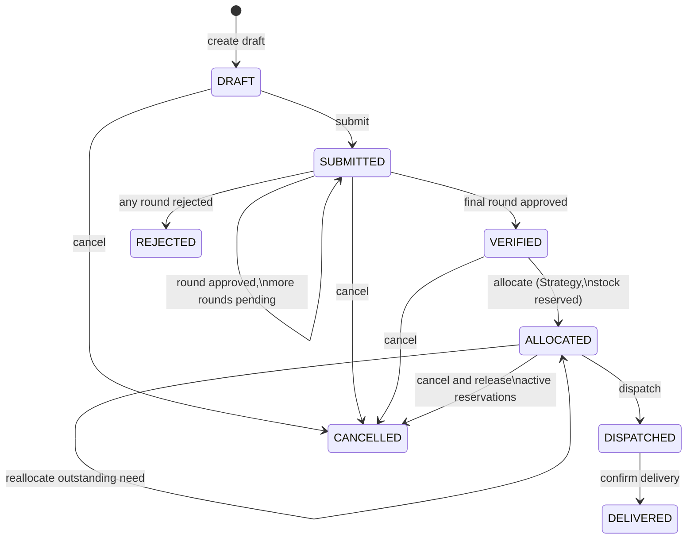

# Architecture

## Layering

```text
JavaFX panes (com.reliefsync.ui)
        ↓
ReliefOperationFacade (workflows) + services (com.reliefsync.service)
        ↓
State / Chain of Responsibility / Strategy (pattern packages)
        ↓
Repositories (com.reliefsync.repository)
        ↓
Database singleton → SQLite (data/reliefsync.db)
```

Dependency rules:

- UI never contains SQL and never talks to repositories for workflow actions — only to the facade and services.
- Services contain business rules and transactions; they delegate lifecycle legality to State, verification depth to the Chain, and distribution policy to Strategy.
- Repositories contain all SQL (parameterized, bounded) and row mapping; they hold no business rules.
- Pattern packages are pure Java with no JavaFX or JDBC imports, so all business logic is unit-testable without a UI or database.

## ER diagram

```mermaid
erDiagram
    USERS ||--o{ RELIEF_REQUESTS : creates
    USERS ||--o{ VERIFICATIONS : decides
    AFFECTED_AREAS ||--o{ RELIEF_REQUESTS : "requests relief"
    RELIEF_REQUESTS ||--|{ REQUEST_ITEMS : contains
    RELIEF_REQUESTS ||--o{ VERIFICATIONS : "verified by rounds"
    RELIEF_REQUESTS ||--o{ ALLOCATIONS : "fulfilled by"
    RELIEF_REQUESTS ||--o{ ALLOCATION_EVENTS : "allocation audited by"
    RELIEF_REQUESTS ||--o{ STATUS_HISTORY : "audited by"
    RELIEF_REQUESTS ||--o| DISPATCH_MANIFESTS : "dispatched with"
    RESOURCES ||--o{ REQUEST_ITEMS : "requested as"
    RESOURCES ||--o{ INVENTORY : "stocked as"
    RESOURCES ||--o{ ALLOCATIONS : "allocated as"
    ALLOCATIONS ||--o{ ALLOCATION_EVENTS : "records events"
    ALLOCATIONS ||--o| DISPATCH_MANIFEST_ITEMS : "loaded as"
    RELIEF_CENTERS ||--o{ INVENTORY : holds
    RELIEF_CENTERS ||--o{ ALLOCATIONS : supplies
    VEHICLES ||--o{ DISPATCH_MANIFESTS : carries
    DISPATCH_MANIFESTS ||--|{ DISPATCH_MANIFEST_ITEMS : contains

    USERS { int id PK "username UNIQUE, role, password_hash (PBKDF2)" }
    AFFECTED_AREAS { int id PK "name UNIQUE, district, population, severity 1-5, active" }
    RELIEF_CENTERS { int id PK "name UNIQUE, location, capacity, active" }
    RESOURCES { int id PK "name UNIQUE, unit, low_stock_threshold, active" }
    INVENTORY { int id PK "center_id FK + resource_id FK UNIQUE, quantity >= 0" }
    RELIEF_REQUESTS { int id PK "area_id FK, priority, status, created_by FK" }
    REQUEST_ITEMS { int id PK "request_id FK, resource_id FK, qty_requested > 0, qty_allocated" }
    VERIFICATIONS { int id PK "request_id FK, round_role, verifier_id FK, approved, comment" }
    ALLOCATIONS { int id PK "request_id FK, center_id FK, resource_id FK, quantity > 0, strategy, active, release metadata" }
    ALLOCATION_EVENTS { int id PK "request_id FK, allocation_id FK, event type, quantity, actor, timestamp" }
    VEHICLES { int id PK "registration UNIQUE, type, capacity > 0, availability status" }
    DISPATCH_MANIFESTS { int id PK "request_id UNIQUE, vehicle_id FK, driver, status, timestamps" }
    DISPATCH_MANIFEST_ITEMS { int id PK "manifest_id FK, allocation_id UNIQUE FK, quantity > 0" }
    STATUS_HISTORY { int id PK "request_id FK, from_status, to_status, changed_by, changed_at" }
```



Constraints are enforced in the schema: foreign keys (with `PRAGMA foreign_keys=ON`), UNIQUE names, CHECK ranges on severity/quantities, and `UNIQUE(center_id, resource_id)` for inventory upserts. Migrations are versioned in `schema_version` and applied automatically at startup.

## Authentication and signup

Passwords are stored only as salted PBKDF2-HMAC-SHA256 hashes. Login and signup normalize usernames to lowercase, and the database enforces uniqueness. Public signup validates the full name, username, password strength, and password confirmation, then creates a `VOLUNTEER` account only; privileged roles cannot be self-assigned. The new account is persisted before the application starts its authenticated session.

## Request lifecycle



Verification rounds by priority: NORMAL → Area Coordinator; HIGH → + Relief Coordinator; CRITICAL → + Administrator. The administrator may act for any round.

## Transport and capacity

Dispatch is one atomic operation: validate the ALLOCATED state, load active reservations, validate driver and capacity, conditionally claim an AVAILABLE vehicle, create its manifest and allocation-backed pickup lines, and transition the request to DISPATCHED. Delivery atomically completes the manifest, transitions the request to DELIVERED, and returns the vehicle to AVAILABLE.

Vehicle availability follows `AVAILABLE → IN_TRANSIT → AVAILABLE`; `MAINTENANCE` and `INACTIVE` vehicles cannot be dispatched. Capacity uses generic academic load units: the sum of active allocated quantities must not exceed vehicle capacity. Manifest lines retain the original allocation links, so multi-center pickup details remain auditable without route optimization.
